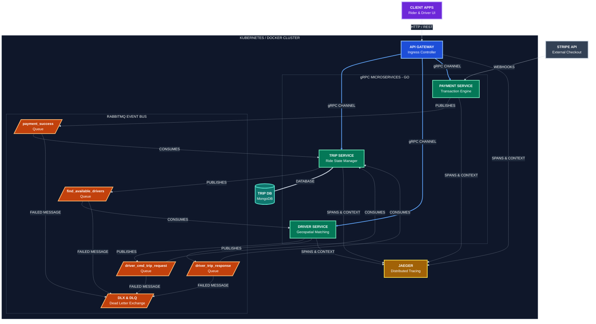

# System Architecture

1. **Ingress Translation:** API Gateway acts as the K8s Ingress, converting external REST/HTTP requests into typed binary gRPC calls for fast internal Go-to-Go communication.

2. **Database per Service:** Trip Service owns its MongoDB ride state. Other services do not access its database directly.

3. **Async Choreography:** Trip Service publishes to `find_available_drivers` and immediately responds, avoiding blocking while searching for a driver.

4. **Targeted Driver Routing:** Driver Service consumes the request, performs geospatial driver matching, and communicates via `driver_cmd_trip_request` and `driver_trip_response` queues.

5. **Webhook Payment Flow:** Stripe processes payment externally, calls the Payment Service webhook, which publishes `payment_success` to RabbitMQ to finalize the ride.

6. **DLX/DLQ Resilience:** Failed or unacknowledged messages are routed through RabbitMQ's **DLX/DLQ** for safe storage and later reprocessing.

7. **Container Scaling:** Docker/K8s enables independent service scaling, e.g. scale Driver Service from `2 → 20` pods without scaling Payment Service.

8. **Distributed Tracing:** Go `context` propagates trace IDs across **HTTP → gRPC → RabbitMQ → services**, while **Jaeger** visualizes the complete ride flow and helps identify latency and failures.

